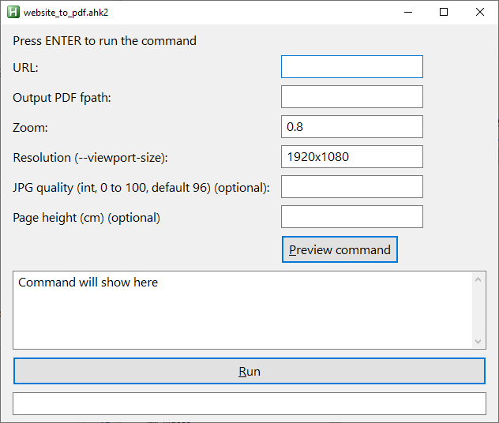
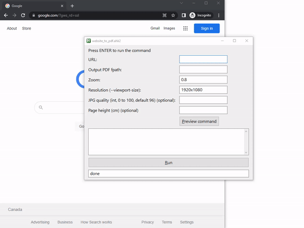
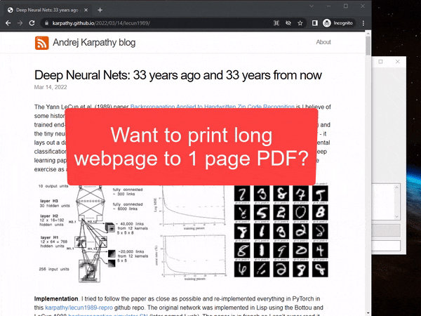

# wkhtmltopdf-GUI
A simple GUI for wkhtmltopdf using AutoHotkey (AHK) v2.

The GUI helps you generate the command line for running `wkhtmltopdf`. [wkhtmltopdf](https://wkhtmltopdf.org/) is an open source (LGPLv3) command line tool to render HTML into PDF using the Qt WebKit rendering engine.

Why would you want this instead of your browser's "Print to PDF" functionality?
Sometimes "printing" the page formats it in strange ways, 
but this creates a PDF that is closer to what you actually see in your browser!

Screenshot:  

## Example Usage

### Demo 1: Make PDF from website

### Demo 2: Make a long, single-page PDF

## Requirements

This GUI requires [AutoHotkey v2](https://www.autohotkey.com/v2/).

## How to Run

Download `website_to_pdf.ahk2` and open it with the AutoHotkey software.